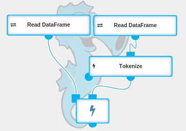
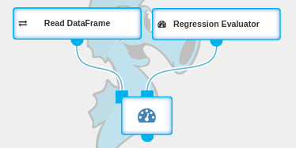
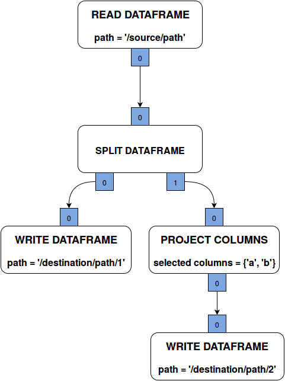

Deeplang is a
<a target="_blank" href="https://en.wikipedia.org/wiki/Visual_programming_language">visual programming language</a>
that lets users create advanced data processing and machine learning workflows.
Deeplang workflow is a graph of connected operations,
which are consuming and producing entities.

### Entities and Classes
Entities are the most crucial part of Deeplang. They represent objects that are being passed between operations,
e.g. [DataFrame](classes/dataframe.html), [Transformer](classes/transformer.html), [Estimator](classes/estimator.html), [Evaluator](classes/evaluator.html).

Entities are immutable - they do not have a state that could be changed. Any modifications are performed by creating new instances based on old ones.

Each entity has a certain _class_ - this concept is similar to class in object-oriented programming languages.

### Operations
Operations are the base building blocks for workflows. Operations serve mainly to produce new entities. Each operation has
$$n$$ input ports, $$m$$ output ports and configurable parameters. Ports are indexed from $$0$$. In order to be executed, an operation needs one entity to be placed in each of its input ports. Additionally, all required parameters have to be filled. When an operation is executed, it produces one entity for each of its output ports.It also can have some side effects (like logging or exporting an entity to an external destination), but it never modifies its input entities (as they are immutable).

  {: .centered-image .img-responsive}

You can think about an operation as a function that receives a tuple of entities and parameters' values, and returns a tuple of entities.

$$Operation: (entity_0, entity_1, …, entity_{n-1}, parameters) \rightarrow (entity_0, entity_1, ... , entity_{m-1})$$

#### Example
[DataFrame](classes/dataframe.html) is an entity. It represents an object that contains data grouped in columns (similarly to R or Spark dataframes).

[ReadDataFrame](operations/read_dataframe.html) is an operation with no input ports and one output port. It is able to read data from an external source and form it into a DataFrame that it will produce in an output port.

[FilterColumns](operations/filter_columns.html) is an operation with one input and two output ports.
It selects a subset of `DataFrame` columns and produces a new `DataFrame` which contains only selected columns.
It returns result `DataFrame` on output port 0 and `ColumnFilterer` `Transformer`
that can be used to perform the same transformation on a different `DataFrame` on output port 1.

[WriteDataFrame](operations/write_dataframe.html) is an operation with one input port and no output ports. It is used to export content of a `DataFrame` to an external destination. Note that, as it has no output, `WriteDataFrame` is interesting only because of it’s side effects (the data is being written to the destination).

### Parameters

An operation can have a set of named parameters. Parameters are modifying the behavior of the operation.

#### Example
In `ReadDataFrame`, parameters can be used to specify the source of data. In `FilterColumns`, parameters are used to specify the set of selected columns.

List of currently supported types of parameters can be found [here](parameter_types.html).

### Type Qualifiers
Each port of an operation has associated type qualifier. A type qualifier of an input port informs what type of entity can be placed in this port. A type qualifier of an output port informs what is a guaranteed type of entity that will be produced in this port.

#### Example 1
The `FilterColumns` operation accepts only  `DataFrames` in its input port. Therefore, the type qualifier of its single input port is `DataFrame`. `FilterColumns` also produces `DataFrames` in its first output port. Therefore, the type qualifier of its first output port is `DataFrame`.

#### Example 2
The [Fit](operations/fit.html) operation serves to create a machine learning model based on a training `DataFrame`. It has two input ports and one output port. The type qualifier of the first input port is: `Estimator`. This means that only entities extending `Estimator` class can be placed in this port. The type qualifier of the output port is `Transformer`. This means that each entity produced by this operation will extend `Transformer` class.

$$Fit: (Estimator, DataFrame) \rightarrow Transformer$$

### Operables

Operables are objects on which operations are performed.

Deeplang operables include (among others) `DataFrames` and special-purpose entities: `Transformers`, `Estimators` and `Evaluators`.

One can think about `Transformers`, `Estimators` and `Evaluators` as encapsulated operations that can be input to higher-order operations.

These categories are analogous to classes in [Spark ML API](http://spark.apache.org/docs/latest/ml-guide.html#main-concepts).
The similarity of Deeplang and Spark class hierarchies allows to reuse logic already available in Spark libraries.

#### Transformers

$$Transformer: DataFrame \rightarrow DataFrame$$

`Transformer` is an abstraction of direct data processing. It consumes a `DataFrame` and produces a `DataFrame`.

`Transformers` can be executed by the [Transform](operations/transform.html) higher-order operation.

#### Example

[Tokenize](operations/tokenize.html) is an operation that outputs transformed `DataFrame` on its left output port
and a `StringTokenizer` `Transformer` on its right output port. Passing `Transformer`
to `Transform` allows to perform `Tokenize` on another `DataFrame`.

{: .img-responsive}

#### Estimators

$$Estimator: DataFrame \rightarrow Transformer$$

`Estimator` is a generalization of a machine learning algorithm. It consumes a `DataFrame` and produces a `Transformer`.

`Estimators` can be executed by `Fit` generic operation.

#### Example

[Logistic Regression](operations/logistic_regression.html) is an operation that outputs an untrained model, which is an `Estimator`.
It is passed to `Fit` operation. We get a trained model as a result of fitting.
The trained model is a `Transformer` that can be used in `Transform` operation for scoring on new data.

{: .img-responsive}

#### Evaluators

$$Evaluator: DataFrame \rightarrow MetricValue$$

`Evaluator` is an abstraction of calculating `DataFrame` metrics. It consumes a `DataFrame` and produces a [MetricValue](classes/metric_value.html).

`Evaluators` can be executed by `Evaluate` generic operation.

#### Example

[Regression Evaluator](operations/regression_evaluator.html) is an operation that outputs an `Evaluator`. It is passed to `Evaluate` operation,
which calculates regression metrics on a previously scored `DataFrame`.

{: .img-responsive}

### Workflows
Deeplang workflow is a directed acyclic graph of connected operations. It represents what actions are to be performed on data.

An entity produced by one operation can be placed as an argument in a port of another operation. This can be represented as a connection between the output port of the first operation and input port of the second one. A workflow is formed from a set of operations and connections between them. Note that from one output port there can be many connections to many different input ports - it means that the entity produced by an operation will be placed as an argument in many different operations. However, there can only be one connection incoming to an input port.

In order to be executed, a workflow must be correct, i.e.:

* it does not contain a cycle
* parameters of all operations must be correct
* each input port must have exactly one incoming connection
* classes of entities passed between ports must meet requirements of these ports' type qualifiers

Note that if two branches of workflow do not depend on each other, they can be executed in parallel.

#### Example

  {: .centered-image .img-responsive}

In the example, there is a simple workflow presented. It reads a `DataFrame` from some external source and then passes it to the [Split](operations/split.html) operation. This operation splits `DataFrame` by rows, producing two new `DataFrame`s. One is immediately written at some destination. The other one is projected to the selected subset of its columns, and then written. Note, that the writing of the left `DataFrame` can be executed simultaneously with projecting and writing of the right `DataFrame`.
