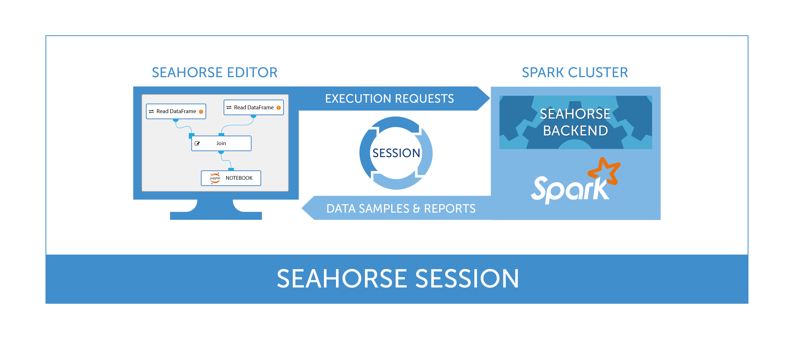

### Introduction

Seahorse is a data analytics platform that defines a new way to create
<a target="_blank" href="https://spark.apache.org/">Apache Spark</a> applications.

Using Seahorse, you can solve complex problems in the areas of machine learning and ETL (Extract,
Transform and Load) without knowing Spark's internals. It provides tools to tackle real world
Big Data problems while letting the user experience a very gentle learning curve. Seahorse takes
care of many complicated concepts and presents a simple, clean interface.

Seahorse emphasizes a visual approach to programming. This results in user's applications being
extremely readable: the logic driving the entire program is visible at first glance.

What’s important, while promoting a code-free working style, Seahorse does not limit users to a
predefined set of actions. Whenever the user encounters a necessity to include a non-standard action
in their application - something that is not covered by Seahorse's palette of operations - they are
free to write their own transformations in
<a target="_blank" href="https://www.python.org/">Python</a>.

Seahorse offers a web-based interface that presents a Spark application as a graph of operations -
a workflow. A typical Seahorse session consists of three alternating phases: adding operations
to the workflow, executing the part of it that's already been created and exploring the results
of the execution. This establishes an interactive process during which the user is able to track
what happens at each step.

  {: .centered-image .img-responsive}

Finally, after the workflow has been constructed, it can be exported and deployed as a typical Spark
application on production clusters.

### A Glimpse of Seahorse's Features

Here's a quick look at Seahorse's main view: the palette of operations and the workflow. The user
builds an application by dragging operations onto the canvas and defining connections between them.
Each operation is configurable via its parameters.

  
  *Seahorse's interface*

Having the newest version of Spark as its backend, Seahorse offers dozens of machine learning
algorithms and data transformations. On top of that, the user is able to define their own
transformations either visually or by embedding arbitrary code in the workflow.

Besides delivering a wide selection of operations, Seahorse’s primary focus is to keep the user
in touch with the data they’re operating on. This ambition is what drove the design of the interface
and functionality. In particular, whenever an operation outputs a data set, the user can either
examine its sample or explore it in more depth using a fully functional
<a target="_blank" href="https://jupyter.org/">Jupyter notebook</a>.

Constructing a workflow is the first of two steps in the process of developing an application.
The second is deploying the application into a production environment. Seahorse makes this
effortless: once an application is complete, it can be exported and run on user's cluster.

	

		
Learn more about Seahorse enterprise-scale deployments
		- includes customized set-up, integration and 24/7 support.

	

	

		

			<a target="_blank" href="http://deepsense.io/about-us/contact/#contact-form-anchor">
			Contact us for details!
			</a>
		

	

