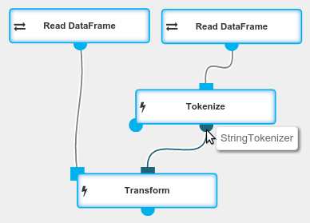

A `Transform` is an operation used to convert a [DataFrame](../classes/dataframe.html) into another
using a [Transformer](../classes/transformer.html).
For example, a trained model produced by a [Fit](../operations/fit.html)
operation can be supplied to `Transform` with a [DataFrame](../classes/dataframe.html) to be converted.

**Usage example**:
{: .img-responsive}

**Since**: Seahorse 1.0.0

## Input

<table>
<thead>
<tr>
<th style="width:15%">Port</th>
<th style="width:15%">Type Qualifier</th>
<th style="width:70%">Description</th>
</tr>
</thead>
<tbody>
<tr>
<td><code>0</code></td>
<td><code><a href="../classes/dataframe.html">DataFrame</a></code></td>
<td>The <code>DataFrame</code> to transform.</td>
</tr>
<tr>
<td><code>1</code></td>
<td><code><a href="../classes/transformer.html">Transformer</a></code></td>
<td>The <code>Transformer</code> to be applied on the input <code>DataFrame</code>.</td>
</tr>
</tbody>
</table>

## Output

<table>
<thead>
<tr>
<th style="width:15%">Port</th>
<th style="width:15%">Type Qualifier</th>
<th style="width:70%">Description</th>
</tr>
</thead>
<tbody>
<tr>
<td><code>0</code></td>
<td><code><a href="../classes/dataframe.html">DataFrame</a></code></td>
<td>The <code>DataFrame</code> which is a result of the <code>Transformer</code> applied on the input <code>DataFrame</code>.</td>
</tr>
</tbody>
</table>
