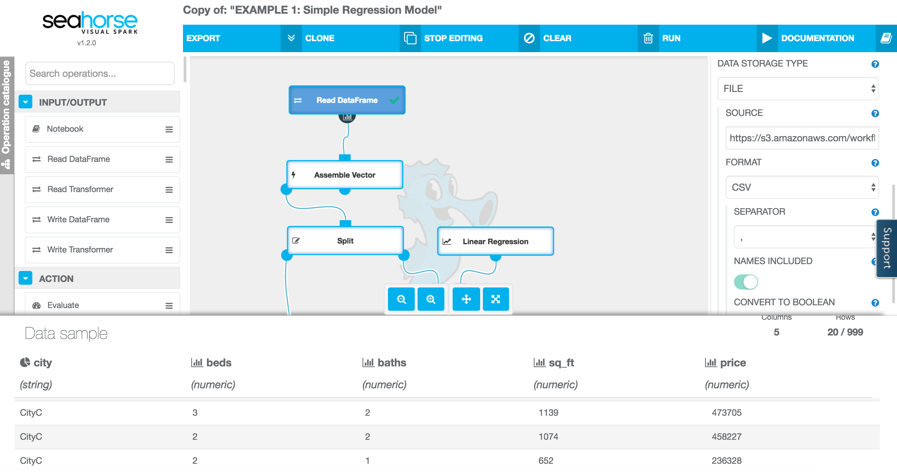
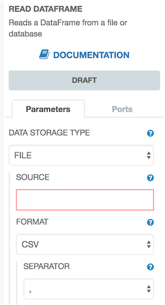
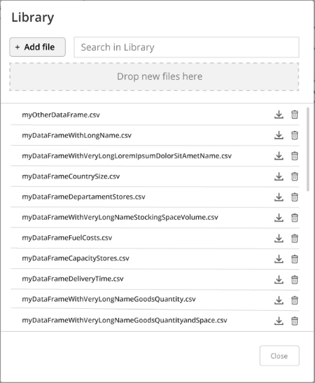

**Table of Contents**

* Table of Contents
{:toc}

## Overview

Seahorse Editor allows you to visually create Spark Applications - workflows.
You can create your own workflows and share them with other users.

From the user perspective **Seahorse Editor** is divided into two components:
**Workflows Manager Interface** and **Interactive Designer**

## Workflows Manager Interface

**Workflow Manager Interface** allows the user to:

* List the created workflows
* Create new workflows
* Clone existing workflows (using  button)
* Stop running sessions (using  button)
* Delete workflows
* Import workflows stored in [JSON format](workflowfile.html)

  {: .centered-image .img-responsive}
  *Workflow Manager Interface*

## Interactive Designer

**Interactive Designer** allows the user to view, design and execute workflows
on Apache Spark cluster.

  {: .centered-image .img-responsive}

It consists of the following panels:

### Operation Palette
Located on the left, contains the list of all the available operations.
User can drag and drop the operations onto the canvas.
The search is available on the top of the panel, it filters the
available operations.

  {: .centered-image .img-responsive}
  *Operation Palette*

### Workflow Canvas

This panel is located in the center. It allows to view and design your workflow.
It allows the user to connect operations output ports as
other operations input ports.

  {: .centered-image .img-responsive}
  *Workflow Canvas*

### Operation Parameters

This panel is located on the right.
It displays parameters available for the operation selected in the
**Workflow Canvas**.

  {: .centered-image .img-responsive}
  *Operation parameters*

### Execution Report

Located at the bottom of the screen. **Execution Report** is available
once the operation has been executed. It displays the information about the
operation results. The report is automatically displayed, once the user clicks
on the output port of the node representing the operation on the on **Workflow Canvas**.

  {: .centered-image .img-responsive}
  *Execution report*

### Workflow Operations Menu

This panel allows the user to:

* Export workflow as a JSON file.
* Start/Stop Editing. This starts/stops the interactive session on Apache Spark.
* Clear. Removes all the operations from the **Workflow Canvas**.
* Run. Executes current workflow.
Available only if the Seahorse in in the Editing Mode.
* Library. Opens the [Files Library](#files-library).
* Documentation. A link to the Seahorse documentation.

  {: .centered-image .img-responsive}
  *Top level menu*

### Files Library

**Files Library** allows the user to upload files from their computer to Seahorse.
Files uploaded this way can be then used by [Read DataFrame](operations/read_dataframe.html) operation.
The user can also write DataFrames to the **Files Library** using [Write DataFrame](operations/write_dataframe.html) operation,
and then download created files to their computer.

  {: .centered-image .img-responsive}
  *Files Library*

