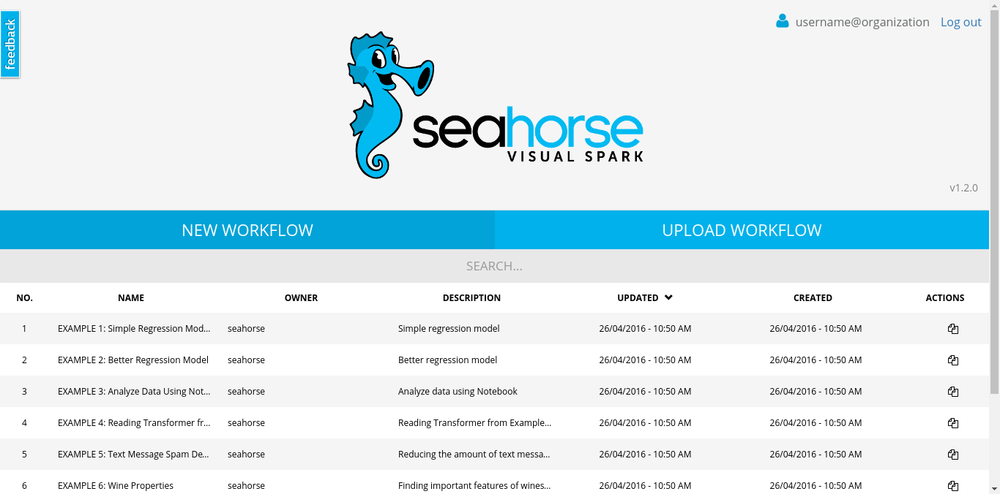

**Table of Contents**

* Table of Contents
{:toc}

## Overview

Seahorse is a data analytics platform that allows you to create Spark applications using a web-based
interactive user interface. You can use Seahorse on Intel's
<a target="_blank" href="http://trustedanalytics.org/">Trusted Analytics Platform</a>. To do so,
log in to your Trusted Analytics Platform deployment and select **Seahorse** from **Data Science**
category in the left panel. There you will see a list of Seahorse instances for your organization.
You can also create a new instance by typing in an instance name and clicking
**Create new Seahorse instance**. Once the instance is created you can navigate to it by clicking
the link in **App Url** column.

  {: .centered-image .img-responsive}
  *Seahorse on Trusted Analytics Platform Overview*

## Using Seahorse on Trusted Analytics Platform

After creating a Seahorse instance from Trusted Analytics Platform console, open it by navigating to
the instance URL in your browser. On the main Seahorse page you can create a workflow or open one of
the examples to see what is possible in Seahorse. The examples cannot be modified - if you want to
change or execute them, click the **CLONE** button in the top panel.

Once you have opened the workflow (either by creating a new one or by cloning one of the examples)
press the **START EDITING** button to start editing the workflow. This will start the Seahorse Spark
application responsible for executing your workflow.

Once you have created a workflow it will show up on the main Seahorse page with your username in the
*OWNER* column. You can only edit workflows which were created by you, all the others are
read-only -- you can always clone any workflow and start working on it.

To find out more on what is possible in Seahorse, see the [Quick Start guide](index.html).

## Platform Information

* Apache Spark, version {{ site.WORKFLOW_EXECUTOR_SPARK_VERSION }}
* Hadoop, version 2.6.0
* Python, version 2.7
* Python libraries, including: NumPy, SciPy, Matplotlib, scikit-learn etc.

### Limitations

* Maximum duration of an interactive session for a single workflow: 7 days.
  After this time, the Spark application responsible for executing your workflow will stop working.

Above limitations refer only to Seahorse on Trusted Analytics Platform.
To learn more about scaling up and using Seahorse in production,
see the <a href="https://seahorse.deepsense.io/enterprise.html">Enterprise</a> page.

	

		
Learn more about Seahorse enterprise-scale deployments
		- includes customized set-up, integration and 24/7 support.

	

	

		

			<a target="_blank" href="http://deepsense.io/about-us/contact/#contact-form-anchor">
			Contact us for details!
			</a>
		

	

